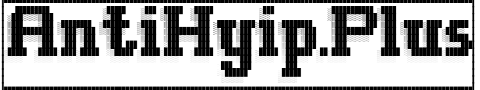

> Нет хайп, нет проблем!

AntiHyip.Plus - экспериментальный меню

/!\ Ссылки на некоторые игры могут быть удалены, перемещены, или хайповыми разработчиками этой игры. При обнаружении этого беспорядка, немедленно сообщите к нам через Issues.

# Меню
[Нажмите, чтобы открыть меню](menu.md)

СОВЕТ: Чтобы сохранить вкладку открытой, нажмите колёсико мыши, если оно поддерживает эту функцию. Если же нет, то кликните правой кнопкой мыши и откройте ссылку в новой вкладке.

# Что это?
Неофициальный клиент, только без хайповых. Нажмите в этот файл, чтобы открыть меню.

# Пошагово
1. Откройте файл, например, yandexgames, чтобы попасть в меню игр. Для поиска игр нажмите клавишу F3 на клавиатуре — это запустит поиск по странице.

2. Когда найдёте нужную игру, выделите её ссылку курсором. Если в ссылке нет пробелов и названия игры, вы можете либо скопировать и вставить её, либо сразу перейти на соответствующий сайт.

3. Начинайте играть!

# ЧАВО
### Я нашел игру, в котором была удалена, куда к вам обратиться?

Сделайте Issues, и тогда я уберу в список.

### Модерация проходит?

Прежде всего, автор проверит вашу игру. Если всё в порядке, он добавит её в файл меню. В противном случае он просто закроет тему.

### Насчёт авторского права, они защищены?

Авторские права не защищены, вы можете создать собственную версию, это не будет нарушением.

### Почему всякие браузерные игры, сайт, например, Игроутка, не добавляете?

Мы не рассматриваем возможность размещения браузерных игр, подобных «Игроутке», на нашем сайте до тех пор, пока пользователь BK782_User не начнёт доверять вашему ресурсу. Если бы он уже проявлял доверие, то, вероятно, сделал бы это. Если вы настаиваете на размещении такой игры, то лучше создайте собственный проект. Это не так сложно, как кажется.

### BK782_User самостоятельно опубликовал ссылку на игру в меню. Как это следует понимать?

С помощью виртуальной машины VirtualBox, работающей под управлением Linux Mint, во избежание трекеров.

### А как же Minecraft Сервер?

Не буду говорить о сервере «Майнкрафт», потому что, во-первых, у некоторых серверов есть защита от пиратства, а мы никогда не занимаемся пиратством. Во-вторых, существуют пиратские лаунчеры, которые могут предлагать установить Яндекс Браузер и другие нежелательные программы, которые сложно или легко удалить, но следы всё равно остаются. И в-третьих, доступ к таким серверам платный. А вот Minetest — это бесплатный и свободный ресурс. Вот так.

### Я нашел игру, которую я хочу добавить, я не знаю, игра хайповая или нет?

Не знаю, как объяснить, но давайте рассмотрим ситуацию на примере бегемота. Сначала была выпущена мобильная игра, а затем появились различные материалы о бегемотах: в реальной жизни, в обычной жизни, жизни без бегемота и так далее. Я думаю, что понятно объяснил свою мысль. Если не уверены, то обратитесь через Issues.

### Какая у него лицензия?

Постронные игры они с разным лицензиями, а вот меню, нет. Можете поставить на любом компьютере, хоть в офисе, хоть в школе, что угодно, но сначала спросите, можно ли это или нет.

### Хейтят ли этот меню игр или нет?

Хейтят или не хейтят, мы же ничего плохого не делаем, добрые пользователи, а если кто-то обнаружил случайно хайповую игру, то напишут через Issues.

# ЧАВО про USB

### Для чего нужна эта папка на флешке?

Чтобы обойти ограничения, которые могут быть установлены в частных сетях, например, в школе или офисе, можно использовать локальные файлы формата txt. Эти файлы хранятся на вашем компьютере и не зависят от сервера.

### Как обновить текстовые файлы.

Замените старые файлы на новые или удалите их, а затем загрузите новые.

### Когда я открываю текстовый файл, то вижу в нём непонятные символы или иероглифы. Как мне исправить эту проблему?

Установите AkelPad Portable и сохраните её на флешке — готово!

К сожалению, в Блокноте, который входит в состав операционной системы Windows, не поддерживаются такие символы. Я не могу это изменить.

### Какие требования для флешки?

Объем NAND памяти: любое

Скорость: тоже любое

Файловая система: любое, но рекомендуется FAT32 или exFAT для Windows, Linux и MacOS от Apple

Хоть и SD, хоть и MicroSD, но главное, чтобы работало. Удачи в игре!

# Как сделать, чтобы BK782_User проверял игру по ссылке Яндекс.Игры?
Выберите игру и запустите её. Когда вы перейдёте на страницу игры, вы увидите обложку с кнопкой «Начать». Обратите внимание, что меню нельзя открыть, пока вы не нажмёте на эту кнопку. После нажатия на «Начать» вы сможете открыть меню. Нажмите на кнопку «Поделиться» и скопируйте ссылку. Не забудьте отправить ссылку на проверку в Issues. Вот и всё!

# Как сделать, чтобы BK782_User проверял игру по ссылке ROBLOX?

1. Откройте сайт Roblox в браузере.

2. Выберите игру, которую хотите копировать ссылку.

3. Как только зашли в страницу про эту игру, на строке браузера скопровайте URL, убедитесь, что URL содержит номер и название в конце.

4. И вы можете отправить в Issues.

5. Всё.

### AntiHyip.Plus не имеет отношения к сервисам, подобным Яндекс.Играм. При использовании данного сервиса вы действуете на свой страх и риск.
