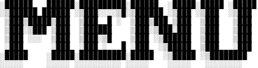

| Сервисы                        |              Ссылка на меню   |
|--------------------------------|-------------------------------|
| Яндекс.Игры (Поддержка для USB)| [Меню](yandexgames.txt)       |
| ROBLOX                         | [Меню](roblox)                |
| Яндекс.Игры для мобильных      | [Меню](yandexgamesMobile)     |
| Minetest сервер                | [Меню](minetestserver)        |

### AntiHyip.Plus не имеет отношения к сервисам, подобным Яндекс.Играм. При использовании данного сервиса вы действуете на свой страх и риск.

# ЧАВО

### Поддержка для USB это что?

Меню имеется с форматом txt, то есть, можно на флешку положить, можно кстати без txt скачать, но будет неудобно открывать файлы, которые без формата.

И чтобы компьютер прочитал этот txt файл, нужна программа блокнот и всё, только убедитесь что не иероглифы и кракозябры, ну короче чтобы буквы и символы были видны правильно. 

### Как мне обновить меню для флешки?

Чтобы обновить меню, нужно скачать новый файл, и заменить вместо старую, в новую, и готово!
